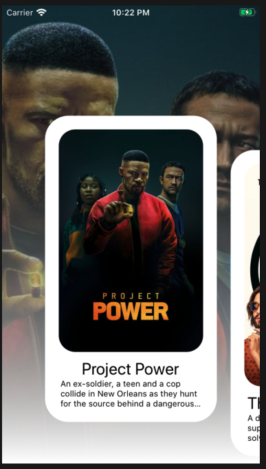

# Movies App



This app was created with expo. Just run `yarn && yarn start`.

## Environment Variables

Create a `./src/config.ts` file with the following environment variables

```ts
// ./src/config.ts
export const REACT_NATIVE_TMDB_API_KEY = "XXXXXXXXXXXXXXXXXXXXXXXXXXXX";
```

## Disclaimer

I used this project to learn more about react-native and I implemented the slider component created by [catalinmiron](https://github.com/catalinmiron) on [this repo](https://github.com/catalinmiron/react-native-movie-2.0-carousel). Respective credits goes to him.
